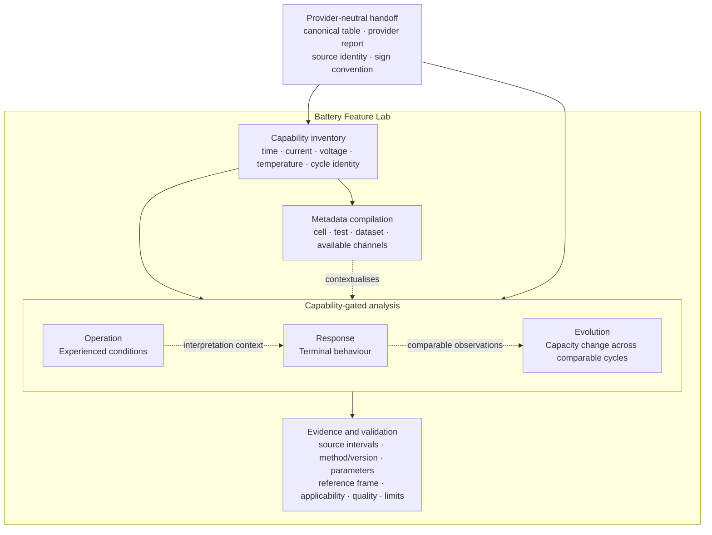

# Battery Feature Lab

[](CHANGELOG.md)
[](pyproject.toml)
[](LICENSE)

Battery Feature Lab (BFL) turns preprocessed battery time-series measurements into compact,
machine-readable analysis with traceable evidence. It describes operating conditions,
electrochemical responses, and change across comparable observations without asking downstream
software to reconstruct those facts from raw arrays.

BFL does not generate prose reports. Its output is JSON and Parquet designed for analytical
software, databases, retrieval systems, and AI tools.

## How BFL is organised

BFL analyses measurements along three complementary, capability-gated dimensions. This diagram
shows conceptual and data dependencies, not the compiler's execution order or a requirement that
every dimension produce an applicable result. Metadata provides context, while evidence and
validation make each result traceable and define its interpretation limits.



Raw files are standardized by Battery Data Standard (BDS). Existing formal Battery Data Format
(BDF) artifacts may instead use the optional `batterydf` adapter. Both routes produce the same
internal quantity names and retain their provider-native report; neither route silently falls back
to the other after a provider error.

## Quick start

Battery Feature Lab supports Python 3.11 and 3.12.

```console
python -m pip install "battery-feature-lab>=0.4,<0.5"
```

Analyze a raw cycler export:

```python
import bfl

result = bfl.analyze(
    "cell.xlsx",
    output_dir="bfl_outputs/cell",
    input_adapter="bds",
    nominal_capacity_ah=None,
    temperature_column=None,
)

for path in result.files:
    print(path)
```

Equivalent CLI:

```console
bfl analyze cell.xlsx --output-dir bfl_outputs/cell --input-adapter bds
```

For native formal-BDF input, install `"battery-feature-lab[bdf]>=0.4,<0.5"` and use
`input_adapter="bdf"`. The optional OpenAI notebook client is available through
`"battery-feature-lab[ai]>=0.4,<0.5"`.

## Output contract

Every successful run writes exactly six artifacts. The provider report filename depends on the
selected input adapter.

```text
normalized_data.bdf.parquet
bds_conversion_report.json       # BDS input
# or bdf_validation_report.json  # formal-BDF input
analysis_metadata.json
analysis_results.json
analysis_evidence.json
analysis_validation.json
```

Start with `analysis_results.json`. It is a compact index over Operation, Response, and Evolution.
Resolve a `record_id` in `analysis_evidence.json` only when source intervals, full series, method
parameters, references, or detailed quality evidence are needed.

Serialized provenance uses portable artifact filenames plus SHA-256 digests. Host-local absolute
paths are never written to the public JSON contract; `configuration.output_dir` is represented as
`.`. The `AnalysisResult` Python object still returns the actual runtime paths.

```python
import json
from pathlib import Path

root = Path("bfl_outputs/cell")
summary = json.loads((root / "analysis_results.json").read_text(encoding="utf-8"))
evidence = json.loads((root / "analysis_evidence.json").read_text(encoding="utf-8"))

record_id = summary["dimensions"]["operation"][0]["record_id"]
record = next(item for item in evidence["records"] if item["record_id"] == record_id)
```

## Progressive capability

BFL does not require every dataset to contain every battery channel.

| Available measurements | Analysis that can be added |
|---|---|
| time + current | phase, current-shape mode, duration-weighted current exposure, Ah throughput, current-squared exposure |
| + voltage | power and energy, current-step response, paired capacity profiles, eligible pulse/ICA/DVA and cycle analyses |
| + temperature | thermal envelope, rest temperature response, temperature comparability gates |
| + trustworthy cycle identity | structurally gated cycle summaries and comparable-capacity evolution |
| + nominal/reference capacity | C-rate and grounded SOC-dependent provider paths where other gates also pass |

Missing optional channels produce explicit `not_computable` metrics and `not_invoked` provider calls.
BFL never creates a voltage channel, assumes a sampling rate, or promotes a filename token into cell
metadata.

## Scientific boundaries

- Operation labels are limited to `constant_current_like`, `constant_voltage_like`, `pulse_like`,
  `dynamic_current`, and `unmatched`. BFL does not infer a named protocol.
- Current-step `delta-V/delta-I` is an apparent terminal response, not intrinsic resistance or SOH.
- Relaxation checkpoints are terminal-voltage recovery, not equilibrium OCV.
- A capacity-aligned coordinate is not SOC unless an explicit reference establishes it.
- Capacity evolution requires source or joined cycle identity, structural completeness, and a
  comparable operation signature. A short test does not support ageing or lifetime claims.
- Metadata fields remain unknown when neither the preprocessing provider nor the caller supplies
  them.

## Documentation

- [Documentation home](docs/index.md)
- [Core architecture](docs/architecture.md)
- [API reference](docs/api.md)

The worked example is
[`examples/BFL_Catenaro_Onori_example.ipynb`](examples/BFL_Catenaro_Onori_example.ipynb). Its source
workbook is available from the cited CC BY 4.0 dataset and is intentionally not tracked here; follow
the [download and checksum instructions](examples/data/Catenaro_Onori_2021/README.md). Derived JSON
examples are under `examples/outputs/Catenaro_Onori_2021/`; full normalized time-series arrays are
also excluded.

## Development

```console
git clone https://github.com/shiyunliu-battery/Battery-Feature-Lab.git
cd Battery-Feature-Lab
uv sync --python 3.12 --extra dev --extra ai
uv run ruff check .
uv run pytest -q
```

Real-data validation instructions are kept in
[`tests/data/real/README.md`](tests/data/real/README.md).

## Citation

If Battery Feature Lab supports your work, please cite the software:

```bibtex
@software{liu_2026_battery_feature_lab,
  author  = {Liu, Shiyun},
  title   = {Battery Feature Lab},
  year    = {2026},
  version = {0.4.0},
  url     = {https://github.com/shiyunliu-battery/Battery-Feature-Lab},
  license = {MPL-2.0}
}
```

GitHub can also generate citation formats from [`CITATION.cff`](CITATION.cff). The included
Catenaro–Onori example data remains separately licensed under CC BY 4.0 and must retain its original
[citation and attribution](examples/data/Catenaro_Onori_2021/README.md).
