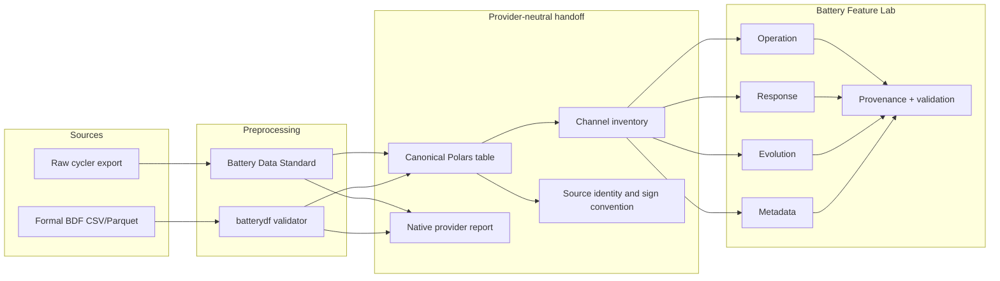
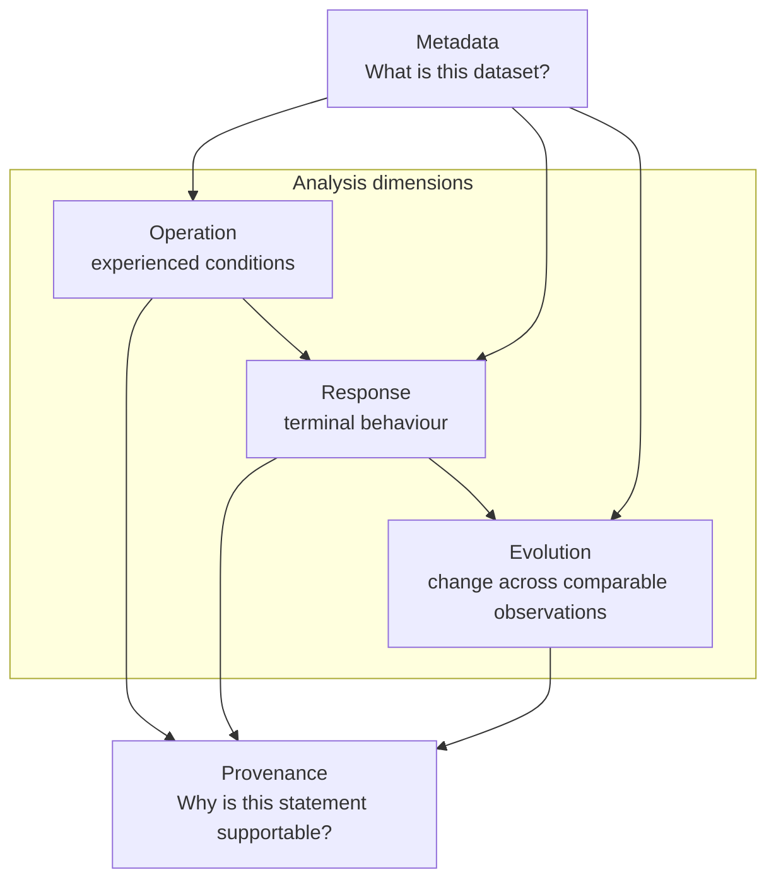
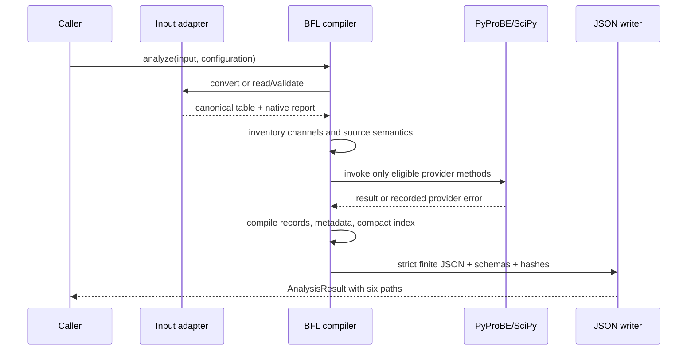

# Architecture

BFL has one analysis core behind two explicit preprocessing adapters. The analysis code never
receives a vendor-specific object or a provider-owned DataFrame.

## System boundary

### Preprocessing owns

- file parsing and vendor mapping;
- standard quantity names and units;
- the current-sign convention;
- source column and conversion provenance;
- provider validation and warnings.

### BFL owns

- channel capability gating;
- source/step-aware operation segmentation;
- duration-weighted exposure;
- previous-sample ZOH capacity and energy branches;
- conservative response eligibility;
- comparable-cycle selection;
- compact indexing, evidence records, metadata compilation, and validation.

### Downstream software owns

- search, visualization, database indexing, and natural-language rendering;
- domain decisions that need manufacturer specifications or project-specific limits;
- learned predictions, mechanistic attribution, and safety decisions.

## Three analysis dimensions

The arrows express interpretation dependency, not a requirement that every dimension produces an
applicable record. For example, time and current can support Operation while voltage-dependent
Response records remain `not_computable`.

## Compiler sequence

Provider errors never trigger an implementation with the same analytical name. A separately named
BFL method may exist only when it is declared in advance and reports its own interpretation limits.

## Design invariants

1. **No fabricated measurements.** Missing channels stay missing.
2. **No hidden repairs.** BDS is called with warning policies so BFL can analyze observed timing.
3. **No row-order assumptions.** Time is sorted for analysis while original source-row identity is
   retained.
4. **No global all-or-nothing gate.** Each record declares its required capabilities.
5. **No orphan result.** Detailed records point to metadata and retain source intervals.
6. **No prose inside the core.** JSON is the stable interoperability surface.
7. **No host-path disclosure.** Serialized files use portable artifact filenames bound to SHA-256
   digests; absolute runtime paths remain only in the in-memory `AnalysisResult`.
